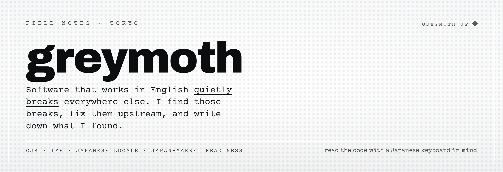

I find the Japan-shaped holes in global software, file the one-line fix into the real repo, and write down what I found. Faceless on purpose: the identity is the voice and the receipts, not a face. Every number below is read live from the GitHub API, so check the state yourself.

## Proof

<!--PROOF:start-->

| merged into OSS | open, in review | failures catalogued |
|:---:|:---:|:---:|
| **105** | **211** | **97** |

<sub>Read live from the GitHub API on 2026-07-03. Nothing on this line is hand-typed.</sub>

<!--PROOF:end-->

The signal that counts is the one a maintainer reviewed and merged. A slice, all in one lane: CJK, IME, and Japanese locale bugs in libraries you probably ship.

| Merged into | The Japan-shaped hole I closed |
|---|---|
| **[tusen-ai/naive-ui #8115](https://github.com/tusen-ai/naive-ui/pull/8115)** | `dynamic-tags` fired on Enter while the IME was still composing, so a half-finished kanji became a tag. Now it waits. |
| **[ant-design/ant-design #58563](https://github.com/ant-design/ant-design/pull/58563)** | `ja-JP` Typography showed the wrong expand and collapse labels. |
| **[medusajs/medusa #15839](https://github.com/medusajs/medusa/pull/15839)** | Filled 511 missing `ja` keys in the admin dashboard. |
| **[Tencent/tdesign-vue-next #6756](https://github.com/Tencent/tdesign-vue-next/pull/6756)** | Esc closed the drawer during IME composition, eating the user's input. |
| **[DouyinFE/semi-design #3313](https://github.com/DouyinFE/semi-design/pull/3313)** | The Japanese Upload crop modal was missing its text. |
| **[NG-ZORRO/ng-zorro-antd #9857](https://github.com/NG-ZORRO/ng-zorro-antd/pull/9857)** | `ja_JP` was missing its quarter placeholders. |
| **[birchill/normal-jp #94](https://github.com/birchill/normal-jp/pull/94)** | The long-vowel mark ー expanded wrong for katakana ヒ and ビ. |
| **[kufu/tamatebako #1428](https://github.com/kufu/tamatebako/pull/1428)** | 和暦 parsing couldn't read 元年 (gan-nen, "year one"). |

The full list of merged and open pull requests is generated live from the GitHub API on the [proof dashboard](https://greymoth-jp.github.io/proof-dashboard/); open ones are marked *in review*, not merged. One receipt of a different kind: [TANE](https://apps.apple.com/app/id6779623465) passed Apple's review and is on the App Store.

## The corpus

Chasing those bugs one at a time, the same shapes kept coming back. So I catalogued them.

**[cjk-failure-corpus](https://github.com/greymoth-jp/cjk-failure-corpus)** · [`live index`](https://greymoth-jp.github.io/cjk-failure-corpus/) — real CJK, IME, and Unicode failures pulled from open-source libraries, each with a repro, the affected libs, and the fix. Eleven categories: IME composition, kana/romaji, width normalization, grapheme-cluster walking, segmentation, and more. Most entries are my own merged PRs, taken verbatim from the API.

## In the lane

Tools that came out of the same work. One theme, no scatter.

| | |
|---|---|
| **[i18n-swarm](https://github.com/greymoth-jp/i18n-swarm)** · [`npm`](https://www.npmjs.com/package/i18n-swarm) | A CI check that fails the PR when a hard-coded or untranslated UI string sneaks in, before your users read the English. |
| **[jp-ready-check](https://github.com/greymoth-jp/jp-ready-check)** | A five-second Japan-readiness scan for any URL: hreflang `ja`, locale path, 特商法, JPY, JP content. |
| **[tokushoho-generator](https://github.com/greymoth-jp/tokushoho-generator)** | Generate a compliant Japanese 特商法 legal-notice page in ten minutes. |

Everything else lives on the [hub](https://greymoth-jp.github.io).

## How I work

```
lane     CJK · IME · Japanese locale · Japan-market readiness
method   read the changelog · trace the text-shaping · one-line fix · write it down
stack    TypeScript · Go · a little WASM · Next.js · Cloudflare Workers
rule     verified, not asserted. "passes our rules," never "certified."
```

## Reach

- **[Glovrex](https://glovrex.com)** — where the Japan-readiness work turns into a product.
- **[greymoth-jp.github.io](https://greymoth-jp.github.io)** — the hub: every tool and every receipt in one place.
- **[@greymoth\_\_](https://x.com/greymoth__)** — build in public, on X.
